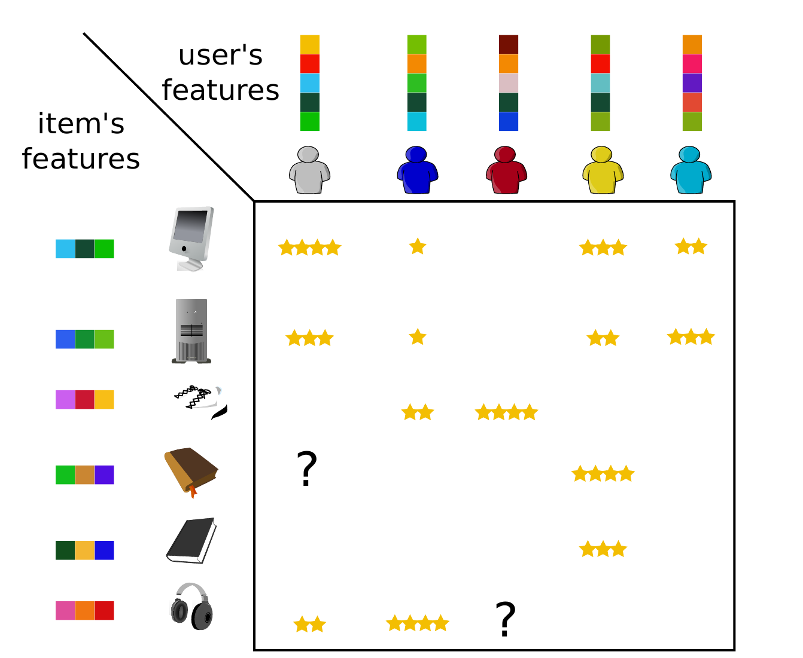

# Movie Recommendation System

This group project aims to predict missing entries in a movie-user ratings matrix from the MovieLens dataset. The codebase is organized into modular components for data preprocessing, matrix completion algorithms, evaluation metrics, and utilities.


<p align="center"></p>


## Documents
For context and overview of the work achieved one can refer to these resources :
- Instructions slides ([instructions.pdf](docs/instructions.pdf))
- Short report presenting our main ideas and results ([report.pdf](docs/report.pdf))
- Slides for the project presentation ([slides.pdf](docs/slides.pdf))

## Requirements
- Python 3.8+
- Dependencies: run `pip install -r requirements.txt` from your desired environment

## Usage
1. Place your MovieLens sparse users/movies rating matrix in the `data/` directory (or any other directory)
2. Run the main script:
```bash
python generate.py --name "data/sparse_matrix"
```

## Core Modules

### metrics
**Evaluation metrics** for matrix completion performance.

**Functions:**
- `rmse(pred_matrix, true_matrix)`: Root Mean Square Error calculation
- `accuracy_exact(pred_matrix, true_matrix)`: Exact accuracy (rounded predictions)

### preprocessing
**Data preprocessing utilities** for matrix completion tasks.

**DataPreprocessor class methods:**
- `fusion()`: Combine training and test matrices
- `split()`: Split ratings into train/test sets
- `normalize_by_user()`: User-centered normalization
- `denormalize_by_user()`: Restore original scale
- `filter_by_threshold()`: Remove users/movies with few ratings

### matrix_completion_methods

**Matrix completion algorithms** implementing different matric completion approaches :

-  **AverageCompletion**: Simple baseline method using row/column averages to fill missing values.

- **MatrixFactorisation**: Advanced method using matrix factorization with two different algorithms (Alternating Least Squares and Gradient-based optimization)

- **IterativePCA**: Iterative PCA-based imputation that alternates between estimating missing entries and computing a low-rank PCA reconstruction until convergence.

- **IterativeKernelPCA**: Extension of the previous method, using kernel techniques to try to capture nonlinear behavior in the data.

### tuning

Utilities for hyper-parameter selection and model validation. Provides basic cross validation and tuning tools such as K-folds and grid search.

